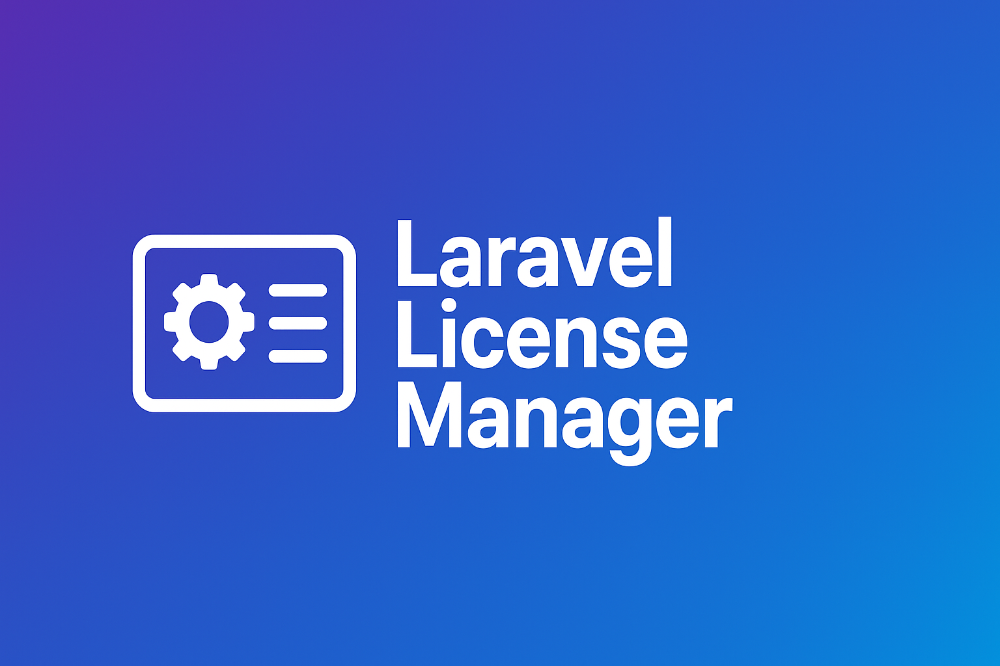

# Laravel License Manager




[](https://packagist.org/packages/nanorocks/laravel-database-newsletter)

A Laravel package for flexible license key management. Ideal for SaaS platforms, plugins, and systems that require license validation, assignment, and lifecycle management. This package allows you to generate, assign, validate, and manage license keys stored in your database. Includes Facade support for easy integration anywhere in your application.

&#x20; &#x20;


## Installation

Install the package via Composer:

```bash
composer require nanorocks/laravel-license-manager
```

Publish and run the migrations:

```bash
php artisan vendor:publish --tag="license-manager-migrations"
php artisan migrate
```

Publish the configuration:

```bash
php artisan vendor:publish --tag="license-manager-config"
```

**Example config file (**``**):**

```php
return [
    'key_length' => 16,
    'default_expiration_days' => 30,
    'table_name' => 'plugin_database_newsletter_licenses',
];
```

## Usage

### Using the Service Class

```php
use Nanorocks\LicenseManager\Services\LicenseService;

$service = app(LicenseService::class);

// Generate a license
$license = $service->createLicense([
    'license_key' => 'TEST-1234',
    'assigned_to' => 'user@example.com',
    'expires_at' => now()->addDays(30),
]);

// Validate a license
$isValid = $service->validateLicense('TEST-1234');

// Assign a license to a user
$service->assignLicense('TEST-1234', 'anotheruser@example.com');

// Deactivate a license
$service->deactivateLicense('TEST-1234');
```

### Using the Facade

```php
use Nanorocks\LicenseManager\Facades\LicenseManager;

$isValid = LicenseManager::validateLicense('TEST-1234');
LicenseManager::assignLicense('TEST-1234', 'user@example.com');
```

### Artisan Command

Generate a license via Artisan:

```bash
php artisan license:generate --assigned-to="user@example.com" --expires-in=30 --key-length=16
```

## Testing

Run the package tests:

```bash
composer test
```

## Changelog

Please see [CHANGELOG](CHANGELOG.md) for detailed information on changes and updates.

## Contributing

Please see [CONTRIBUTING](CONTRIBUTING.md) for contribution guidelines.

## Security Vulnerabilities

Report any security issues via [our security policy](../../security/policy).

## Credits

- [Nanorocks](https://github.com/nanorocks)
- All Contributors ([GitHub](../../contributors))

## License

This package is open-source under the MIT License. See [LICENSE](LICENSE.md) for details.
